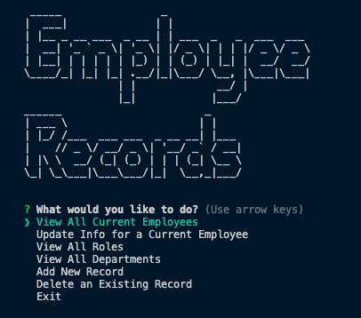
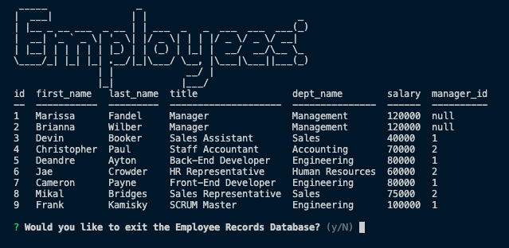
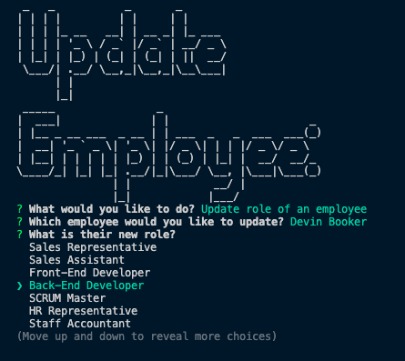

# Employee Records Database

## Table of Contents:

- [Description](#description)
- [Usage](#usage)
- [Installation](#installation)
- [Link to GitHub Repo](#link-to-github-repo)
- [Link to Video Walkthrough](#link-to-video-walkthrough)
- [Screenshots](#screenshots)
- [Questions](#questions)

[](https://opensource.org/licenses/)

## Description

The purpose of this application is to provide a Content Management System to store a company's employee data.

## Usage

A user can create, read, update, or delete records from the database. Records include employee names, roles, departments, salaries, and managers.

## Installation

First, clone down the repository to your local machine, and navigate to the cloned-down directory in your terminal. Then, EITHER start your mysql shell and run

```
SOURCE db/schema.sql
```

OR copy the code from schema.sql into your mySQL Workbench and execute. You should then modify the seeds.sql file to populate the tables with information specific to your company. Once the seeds.sql file has been updated, repeat the same steps you took for executing the schema.sql file. Next, run

```
npm i
```

to install the necessary node modules. Finally, run

```
node index.js
```

to run the CMS. Make sure to change the password in index.js to your own mySQL password.

## Link to GitHub Repo

https://github.com/mfandel118/Employee-Tracker

## Link to Video Walkthrough

https://drive.google.com/file/d/1L4fOl1zj7KXAY9RZZhPZ8JUgfQKr2pQF/view

## Screenshot(s)







## Questions

Any additional questions about this project? Please feel free to reach out:

Marissa Fandel

- Email: mfandel118@gmail.com
- GitHub: https://github.com/mfandel118
